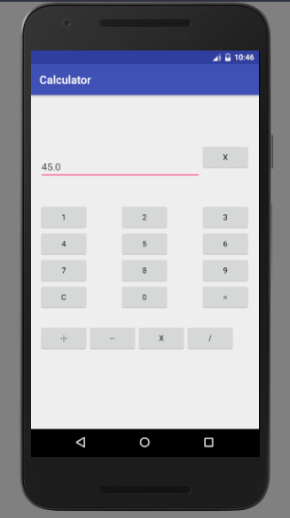

# Calculator

A functionally working calculator. Strictly beginner level efficiency.

Followed [this](https://www.youtube.com/watch?v=sJzLqcBUaKQ) tutorial on YT.

This is how it looks. Completely naive, I know.

