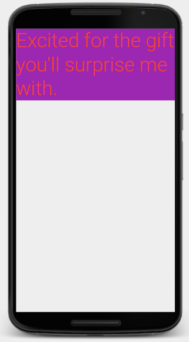
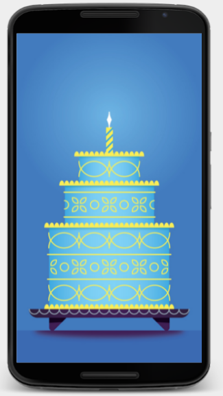
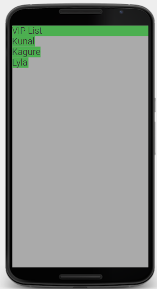
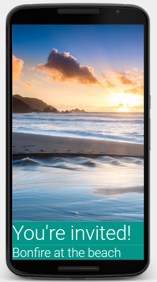

# App_etite
Android apps learning dump
My phone configuration is SDK 22(5.1), so I build my app for the same configuration.

Cheap tricks to get your app working in Android studio 2.2.2 :

* Standard problem : `Error:Failed to resolve: junit:junit:4.12
Show in Project Structure dialog`

 The hack for this is to write the text from [sample build.gradle file](build.gradle_sample.md). Internet connection may be required for builds if it needs to fetch data from maven.org

## The NewBoston Experience

I'll be folllowing basic thenewboston's tutorial on [youtube](https://www.youtube.com/watch?v=QAbQgLGKd3Y&list=PL6gx4Cwl9DGBsvRxJJOzG4r4k_zLKrnxl) first, and then proceed to other resources.(A total of 77 videos). Thanks, but no thanks this time bucky; a realisation I had after video 11.

Most of the app folders are half-baked, not stand alone completed apps. The completed apps deserve a repo of their own, links to which are mentioned separately.

[Cheat sheet](AndroidCheatSheet.pdf) : `Help > Default keymap references`

The basic code conventions are in [app1](app1/).
[Activity state diagram](activity-states.png) upto video 10.

Lesson 11 onwards - [Hamblaster](Hamblaster/). A useless template, of no use whatsoever.

Further videos were pointless, since Bucky's Tutorials weren't suitable for Studio 2.2.2

## The Random excursion

Let's make a [calculator](https://www.youtube.com/watch?v=sJzLqcBUaKQ), because YTF not ?

## The Udacity Development

Disheartened, I fell to the standard partner of [Google](https://developers.google.com/training/programs/india/?utm_source=facebook_IN_en_cg&utm_campaign=IN_android_skilling&utm_medium=display_banner&dclid=CNT0i-2K7tACFVYZjwodqIIERQ) for the android tutorials, Udacity.

Since I have alot of time on my hand, first the [n00b course](https://www.udacity.com/course/android-development-for-beginners--ud837), then I'll proceed to the [programmer course](https://www.udacity.com/course/new-android-fundamentals--ud851).

### Textview
* [XML Visualiser](http://labs.udacity.com/android-visualizer/#/android/text-view)
* [Style guide](https://material.google.com/style/typography.html#typography-typeface)
* [Color guide](https://material.google.com/style/color.html#color-color-palette)

<pre style="background: rgb(238, 238, 238); border: 1px solid rgb(204, 204, 204); padding: 5px 10px;"> TextView
    android:text="Excited for the gift you'll surprise me with."
    android:background="#9C27B0"
    android:layout_width="wrap_content"
    android:layout_height="wrap_content"
    android:textSize="45sp"
    android:textColor="#F44336"/> </pre>

### Imageview

<pre style="background: rgb(238, 238, 238); border: 1px solid rgb(204, 204, 204); padding: 5px 10px;"> ImageView
    android:src="@drawable/cake"
    android:layout_width="wrap_content"
    android:layout_height="wrap_content"
    android:scaleType="centerCrop"/> </pre>

[Official Documentation](https://developer.android.com/index.html)

### Layouts and viewgroups

Assume a `<` before each LinearLayout and TextView tag
<pre style="background: rgb(238, 238, 238); border: 1px solid rgb(204, 204, 204); padding: 5px 10px;"> LinearLayout
    xmlns:android="http://schemas.android.com/apk/res/android"
    android:orientation="vertical"
    android:layout_width="match_parent"
    android:layout_height="match_parent"
    android:background="@android:color/darker_gray">

    TextView
        android:text="VIP List"
        android:layout_width="match_parent"
        android:layout_height="wrap_content"
        android:background="#4CAF50"
        android:textSize="24sp" />

    TextView
        android:text="Kunal"
        android:layout_width="wrap_content"
        android:layout_height="wrap_content"
        android:background="#4CAF50"
        android:textSize="24sp" />

    TextView
        android:text="Kagure"
        android:layout_width="wrap_content"
        android:layout_height="wrap_content"
        android:background="#4CAF50"
        android:textSize="24sp" />

    TextView
        android:text="Lyla"
        android:layout_width="wrap_content"
        android:layout_height="wrap_content"
        android:background="#4CAF50"
        android:textSize="24sp" />

/LinearLayout></pre>

### Layout widths
<pre style="background: rgb(238, 238, 238); border: 1px solid rgb(204, 204, 204); padding: 5px 10px;">LinearLayout
    xmlns:android="http://schemas.android.com/apk/res/android"
    android:orientation="vertical"
    android:layout_width="match_parent"
    android:layout_height="match_parent">

    ImageView
        android:src="@drawable/ocean"
        android:layout_width="wrap_content"
        android:layout_height="0"
        android:layout_weight="1"
        android:scaleType="centerCrop" />

    TextView
        android:text="You're invited!"
        android:layout_width="match_parent"
        android:layout_height="wrap_content"
        android:layout_weight="0"
        android:textColor="@android:color/white"
        android:textSize="54sp"
        android:background="#009688" />

    TextView
        android:text="Bonfire at the beach"
        android:layout_width="match_parent"
        android:layout_height="wrap_content"        
        android:layout_weight="0"
        android:textColor="@android:color/white"
        android:textSize="34sp"
        android:background="#009688" />

/LinearLayout></pre>

### Relative layout

[RTFD](https://developer.android.com/reference/android/widget/RelativeLayout.LayoutParams.html?utm_source=udacity&utm_medium=course&utm_campaign=android_basics)
